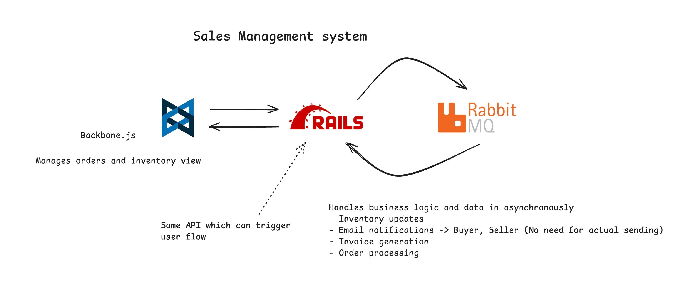

# Sales Management System

A comprehensive sales management system built with Ruby on Rails backend and React frontend. This system helps businesses manage their sales operations, inventory, and customer relationships efficiently.



## Features

- User Authentication and Authorization
- Product Management
- Inventory Tracking
- Sales Order Processing
- Customer Management
- Reporting and Analytics
- Real-time Dashboard

## Tech Stack

### Frontend
- React.js
- Material-UI
- Redux for state management
- Axios for API calls

### Backend
- Ruby on Rails
- PostgreSQL
- Redis for caching
- JWT for authentication

## Prerequisites

- Docker and Docker Compose
- Node.js (v14 or higher)
- Ruby (v3.0 or higher)
- PostgreSQL

## Getting Started

1. Clone the repository:
```bash
git clone [repository-url]
cd sales-management-system
```

2. Environment Setup:
```bash
cp .env.example .env
# Configure your environment variables in .env file
```

3. Start the application using Docker:
```bash
# Development environment
docker-compose up

# Production environment
docker-compose -f docker-compose.prod.yml up
```

4. Access the application:
- Frontend: http://localhost:3000
- Backend API: http://localhost:8000

## Project Structure

```
sales-management-system/
├── frontend/                    # React frontend application
│   ├── node_modules/           # Dependencies
│   ├── public/                 # Static files
│   ├── src/                    # Source code
│   │   ├── components/        # React components
│   │   ├── hooks/            # Custom hooks
│   │   ├── pages/            # Page components
│   │   ├── App.js            # Main React component
│   │   ├── index.css         # Global styles
│   │   └── index.js          # Entry point
│   └── package.json          # Frontend dependencies and scripts
│
├── backend/                    # Rails backend application
│   ├── app/                   # Application code
│   ├── config/               # Configuration files
│   ├── db/                   # Database files
│   └── Gemfile              # Backend dependencies
│
├── docker-compose.yml         # Development Docker configuration
├── docker-compose.prod.yml    # Production Docker configuration
└── README.md                 # Project documentation
```

## Development

### Running Tests
```bash
# Frontend tests
cd frontend
npm test

# Backend tests
cd backend
rails test
```

### Code Linting
```bash
# Frontend
cd frontend
npm run lint

# Backend
cd backend
rubocop
```

## Deployment

The application can be deployed using Docker:

1. Build the production images:
```bash
docker-compose -f docker-compose.prod.yml build
```

2. Start the production containers:
```bash
docker-compose -f docker-compose.prod.yml up -d
```

## Contributing

1. Fork the repository
2. Create your feature branch (`git checkout -b feature/AmazingFeature`)
3. Commit your changes (`git commit -m 'Add some AmazingFeature'`)
4. Push to the branch (`git push origin feature/AmazingFeature`)
5. Open a Pull Request

## License

This project is licensed under the MIT License - see the LICENSE file for details.

## Support

For support, please contact [your-email] or create an issue in the repository.